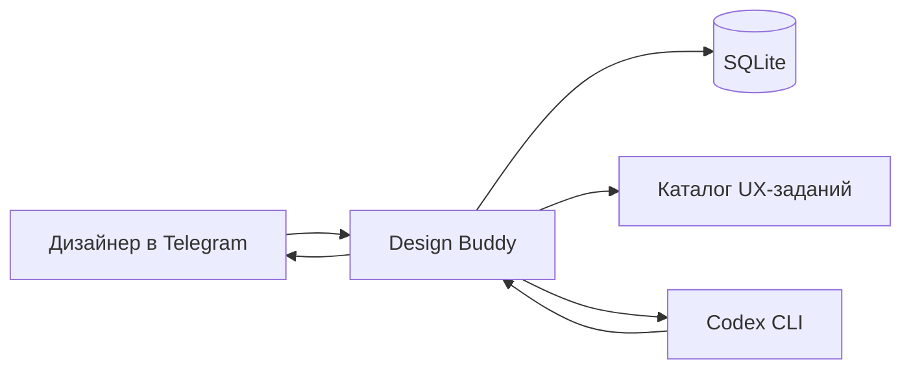

# Design Buddy

[](https://github.com/rottenrust/design-buddy/releases)


[](LICENSE)

**Design Buddy** — open-source Telegram-наставник для начинающего UX/UI-дизайнера. Он формирует профиль навыков, предлагает практические задания, объясняет работу небольшими шагами и сохраняет прогресс между диалогами.

Это не обычный чат с дизайн-промптом: активное задание запускает управляемый учебный сценарий с понятным результатом и проверкой по рубрике.

## Как это работает

```text
первичный опрос
→ профиль 12 UX-навыков
→ практическое задание на конкретный навык
→ пошаговое объяснение и практика
→ проверка по рубрике
→ обновление профиля
```

## Возможности

- Telegram-бот на aiogram 3 через long polling.
- Первичный опрос и постоянный профиль по 12 основным UX-навыкам.
- По одному практическому заданию на каждый навык из YAML-каталога.
- Пошаговый сценарий активного задания вместо свободного неструктурированного чата.
- Проверка результата по рубрике и сохранение evidence.
- SQLite-хранилище с безопасным обновлением схемы поверх базы v0.1.
- Rolling summary, последние сообщения и долговременная персональная память.
- One-shot запуск `codex exec` на каждое входящее сообщение без постоянной agent-сессии.

## Архитектура



Для каждого сообщения backend восстанавливает ограниченный контекст из SQLite и каталога заданий, запускает новый независимый процесс Codex CLI, валидирует результат и сохраняет разрешённые изменения состояния.

## Требования

- Python 3.12.
- Установленный и заранее авторизованный `codex` CLI.
- Telegram bot token от BotFather.
- Telegram ID пользователя, которому разрешён доступ к боту.

Бот не хранит API-ключ модели и не вызывает API LLM-провайдера напрямую. Авторизация агента выполняется вне приложения, в среде запуска `codex` CLI.

## Установка

```bash
git clone https://github.com/rottenrust/design-buddy.git
cd design-buddy
python3.12 -m venv .venv
source .venv/bin/activate
pip install -e ".[dev]"
```

Создайте локальный файл конфигурации из шаблона:

```bash
cp .env.example .env
```

Заполните `.env` реальными локальными значениями. Не коммитьте этот файл: он предназначен только для вашей среды запуска.

```dotenv
TELEGRAM_BOT_TOKEN=<telegram bot token>
ALLOWED_TELEGRAM_USER_ID=<your telegram user id>
DATABASE_URL=sqlite+aiosqlite:///./design_buddy.db
LOG_LEVEL=INFO
```

## Запуск

Проверьте, что `codex` доступен и авторизован:

```bash
codex --version
codex exec "Ответь одним словом: OK"
```

Приложение передаёт в `codex exec` модель `gpt-5.4-mini` и `medium` reasoning effort. Эти параметры фиксируются в коде и не добавляются в `.env`.

Запустите бота:

```bash
python -m app.main
```

После запуска бот работает через long polling. Для быстрой проверки отправьте в Telegram команды `/start` и `/tasks`.

## Конфигурация

Доступные переменные окружения описаны в `.env.example`:

- `TELEGRAM_BOT_TOKEN` — токен Telegram-бота.
- `ALLOWED_TELEGRAM_USER_ID` — Telegram ID единственного пользователя, которому разрешён доступ.
- `DATABASE_URL` — строка подключения SQLAlchemy к SQLite.
- `LOG_LEVEL` — уровень логирования приложения.

По умолчанию проект рассчитан на персональное single-user использование. Это осознанное ограничение MVP, а не multi-user платформа.

## Документация

- [`docs/MVP.md`](docs/MVP.md) — единая актуальная постановка v0.2.
- [`AGENTS.md`](AGENTS.md) — правила работы для Codex и других агентов.
- [`data/tasks.yaml`](data/tasks.yaml) — каталог 12 навыков и 12 практических заданий.
- [`CHANGELOG.md`](CHANGELOG.md) — история версий.
- [`CONTRIBUTING.md`](CONTRIBUTING.md) — правила внесения изменений.

## Проверка

```bash
ruff check .
pytest
```

В тестах используется fake agent runner; реальный агент и сетевые вызовы не запускаются.

## Текущий релиз

Последняя стабильная версия — **v0.2.0**. Описание изменений находится в [`CHANGELOG.md`](CHANGELOG.md) и на странице [GitHub Releases](https://github.com/rottenrust/design-buddy/releases).

## Ограничения

Design Buddy намеренно остаётся простым персональным наставником. В v0.2 не входят multi-user роли, админ-панель, RAG, vector store, прямые вызовы API LLM-провайдера, PostgreSQL, Redis, Celery, FastAPI и постоянные agent-сессии.

## Лицензия

Проект распространяется по лицензии MIT. См. [`LICENSE`](LICENSE).
